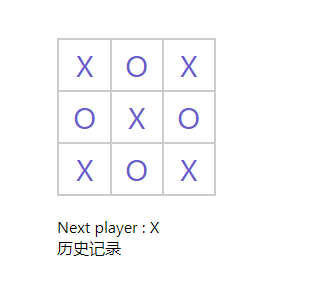

#### React 脚手架
npm install -g create-react-app
#### 创建项目
npx create-react-app my-reactive-app
#### 运行项目
npm start

#### Game
###### 完成具有以下功能的井字棋：
- tic-tac-toe(三连棋)游戏的所有功能
- 官网demo
  - 能够判定玩家何时获胜 (GameStep1.js)
  - 能够记录游戏进程 (GameStep1.js)
  - 允许玩家查看游戏的历史记录，也可以查看任意一个历史版本的游戏棋盘状态
- 课后作业
  - 在游戏历史记录列表显示每一步棋的坐标，格式为 (列号, 行号)。
  - 在历史记录列表中加粗显示当前选择的项目。
  - 使用两个循环来渲染出棋盘的格子，而不是在代码里写死（hardcode）。
  - 添加一个可以升序或降序显示历史记录的按钮。
  - 每当有人获胜时，高亮显示连成一线的 3 颗棋子。
  - 当无人获胜时，显示一个平局的消息。
- 增加
  - 改变棋盘大小 ()
  - 选择模式 (GameStep1.js)
  - 重新开始 (GameStep1.js)
#### 根据React哲学，分析完成项目
###### 思考如何构建一个应用
1. 分析设计稿：
(1) 将UI划分为组件：将组件当作一个函数或对象，根据单一功能原则判定组件的范围(一个组件原则上只能负责一个功能)
  组件1：Square，生成棋子 => 'X'或'O'
  组件2：Board，生成表盘 => 九格
  组件3：Game，游戏界面 => 显示游戏界面：棋盘，文字提示，历史记录
(2) 划分层级：包含，并列关系
  Game > Board > Square

2. 用React创建一个静态版本：将渲染UI和添加交互两个过程分开
(1)state 代表了随时间会产生变化的数据，应当仅在实现交互时使用。
(2)目前只需提供 render() 方法用于渲染
(3)自下而上或自上而下构建

3. 确定UI的最小最完整的state
(1)找出引用需要的数据，看哪些是可以归纳到state中的。
  data:[记录下一个下棋的人，记录棋盘状态，胜利的人，]
(2)只保留应用所需的可变 state 的最小集合，其他数据均由它们计算产生。(保证state的小巧干练，没有多余的变量)
(3)通过问自己以下三个问题，你可以逐个检查相应数据是否属于 state：
  A.该数据是否是由父组件通过 props 传递而来的？如果是，那它应该不是 state。
  B.该数据是否随时间的推移而保持不变？如果是，那它应该也不是 state。
  C.你能否根据其他 state 或 props 计算出该数据的值？如果是，那它也不是 state。
4. 确定state的位置：共享数据的组件或更高层级组件中
5. 添加反向数据流：回调函数将调用 setState()更新应用

<!-- 那些年犯过的愚蠢的错1 -->
给盒子添加了点击事件，却没有给盒子大小，点击没有反应。
导致一直找问题，一直找呀找呀，把每一句都试过后，有固定文本，点击成功，动态数据，没反应，
灵光一闪，是不是样式问题，终于，阔以了。
